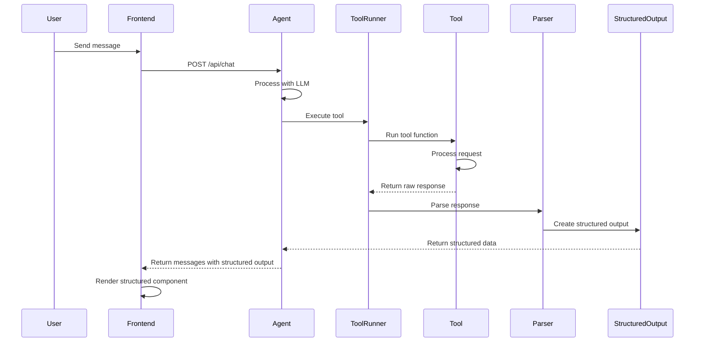

# Chatbot Agent - Design Document

## Overview

This document explains how the chatbot agent converts tool responses into structured outputs and how the frontend consumes these outputs to provide rich, interactive user experiences.

## Architecture Overview

The application follows a simple, layered architecture:

```
┌─────────────────┐    ┌─────────────────┐    ┌─────────────────┐
│   Frontend      │    │   Backend       │    │   Tools         │
│   (React/Next)  │◄──►│   (Next.js API) │◄──►│   (Functions)   │
└─────────────────┘    └─────────────────┘    └─────────────────┘
         │                       │                       │
         │                       │                       │
         ▼                       ▼                       ▼
┌─────────────────┐    ┌─────────────────┐    ┌─────────────────┐
│ Structured      │    │ Agent &         │    │ Tool            │
│ Output          │    │ Tool Runner     │    │ Functions       │
│ Components      │    │                 │    │                 │
└─────────────────┘    └─────────────────┘    └─────────────────┘
```

## Tool Response to Structured Output Flow

### 1. Tool Execution Pipeline

The flow begins when a user sends a message that triggers a tool call:



### 2. Tool Response Processing

#### Step 1: Tool Execution
Tools are simple functions that return structured JSON responses:

```typescript
// Example: movieSearch.ts
export const movieSearch: ToolFn<Args, string> = async ({ toolArgs, userMessage }) => {
    // 1. Process the request (e.g., query movie database)
    const results = await queryMovies(toolArgs);
    
    // 2. Create structured response
    const structuredResponse = {
        type: 'movie_recommendations',
        data: {
            recommendations: formattedResults.slice(0, 5),
            query: query,
            genre: genre
        },
        metadata: {
            title: 'Movie Recommendations',
            description: `Found ${formattedResults.length} movie recommendations`
        },
        contextualMessage: await generateContextualMessage(...)
    };
    
    // 3. Return JSON string
    return JSON.stringify(structuredResponse, null, 2);
};
```

#### Step 2: Response Parsing
The `parseToolResponse` function converts raw tool responses to structured outputs:

```typescript
// In lib/structured-parser.ts
export function parseToolResponse(toolName: string, response: string): StructuredOutput | null {
    if (toolName === 'movie_search') {
        return parseMovieSearchResponse(response);
    }
    if (toolName === 'generate_image') {
        return parseImageGenerationResponse(response);
    }
    return null;
}

function parseMovieSearchResponse(response: string): MovieRecommendationsOutput | null {
    try {
        const data = JSON.parse(response);
        
        // Check if this is already a structured response
        if (data.type === 'movie_recommendations' && data.data && data.data.recommendations) {
            return data as MovieRecommendationsOutput;
        }
        
        // Handle legacy array format
        if (Array.isArray(data) && data.length > 0) {
            return {
                type: 'movie_recommendations',
                data: {
                    recommendations: data.map(movie => ({
                        title: movie.title || 'Unknown',
                        year: movie.year || new Date().getFullYear(),
                        // ... other fields
                    })),
                    genre: data[0]?.genre?.toLowerCase()
                },
                metadata: {
                    title: 'Movie Recommendations',
                    description: `Found ${data.length} movie recommendations`
                }
            };
        }
    } catch (error) {
        console.error('Error parsing movie search response:', error);
    }
    
    return null;
}
```

#### Step 3: Structured Output Attachment
The agent attaches structured output to the final response:

```typescript
// In agent.ts
const toolResponse = await runTool(toolCall, userMessage);
await saveToolResponse(toolCall.id, toolResponse);

// Parse structured output from tool response and store for later
const structuredOutput = parseToolResponse(toolCall.function.name, toolResponse);
if (structuredOutput) {
    pendingStructuredOutput = structuredOutput;
}

// Later, when creating final response
if (pendingStructuredOutput) {
    (response as any).structuredOutput = pendingStructuredOutput;
    // Clear text content to avoid duplication
    response.content = "";
}
```

### 3. Structured Output Types

#### Type Definitions
All structured outputs follow a consistent interface:

```typescript
// In types/structured.ts
export interface MovieRecommendationsOutput {
    type: 'movie_recommendations';
    data: {
        recommendations: MovieRecommendation[];
        query?: string;
        genre?: string;
    };
    metadata: {
        title: string;
        description: string;
    };
    contextualMessage?: string;
}

export interface ImageGenerationOutput {
    type: 'image_generation';
    data: {
        url: string;
        prompt: string;
        alt?: string;
    };
    metadata: {
        title: string;
        description: string;
    };
    contextualMessage?: string;
}

export type StructuredOutput = MovieRecommendationsOutput | ImageGenerationOutput;
```

#### Movie Recommendation Structure
```typescript
export interface MovieRecommendation {
    title: string;
    year: number;
    description: string;
    genre?: string;
    director?: string;
    rating?: number;
    metascore?: number;
    tags?: string[];
}
```

## Frontend Consumption

### 1. Message Flow

The frontend receives messages with structured outputs through the chat API:

```typescript
// Chat API Response
interface ChatResponse {
    success: boolean;
    messages: ChatMessage[];
}

interface ChatMessage {
    role: 'user' | 'assistant' | 'tool';
    content: string;
    structuredOutput?: StructuredOutput;
    tool_calls?: ToolCall[];
}
```

### 2. Component Rendering

#### MessageBubble Component
The `MessageBubble` component handles rendering of both regular messages and structured outputs:

```typescript
export default function MessageBubble({ message }: MessageBubbleProps) {
    const isUser = message.role === 'user';
    
    return (
        <div className={`flex ${isUser ? 'justify-end' : 'justify-start'}`}>
            {/* Regular message content */}
            {(!isUser && message.structuredOutput && !message.content) ? null : (
                <div className="message-bubble">
                    <div className="whitespace-pre-wrap">{message.content}</div>
                </div>
            )}

            {/* Structured output rendering */}
            {!isUser && message.structuredOutput && (
                <div className={message.content ? "mt-4" : ""}>
                    <StructuredOutputComponent output={message.structuredOutput} />
                </div>
            )}
        </div>
    );
}
```

#### StructuredOutput Component
The main structured output component routes to specific renderers:

```typescript
export default function StructuredOutputComponent({ output }: StructuredOutputProps) {
    switch (output.type) {
        case 'movie_recommendations':
            return <MovieRecommendations output={output} />;
        case 'image_generation':
            return <ImageGeneration output={output} />;
        default:
            return null;
    }
}
```

### 3. Specialized Components

#### Movie Recommendations Component
Renders rich movie cards with ratings, descriptions, and metadata:

```typescript
export default function MovieRecommendations({ output }: MovieRecommendationsProps) {
    const { data } = output;
    const topPick = data.recommendations[0];

    return (
        <div className="movie-recommendations-container">
            {/* Header with metadata */}
            <div className="header">
                <h3>{output.metadata.title}</h3>
                <p>{output.contextualMessage || output.metadata.description}</p>
            </div>

            {/* Top pick highlight */}
            {topPick && (
                <div className="top-pick">
                    <h5>{topPick.title}</h5>
                    <p>{topPick.description}</p>
                    {topPick.rating && <RatingBadge rating={topPick.rating} />}
                </div>
            )}

            {/* All recommendations */}
            <div className="recommendations-list">
                {data.recommendations.slice(1).map((movie, index) => (
                    <MovieCard key={index} movie={movie} />
                ))}
            </div>
        </div>
    );
}
```

#### Image Generation Component
Displays generated images with download links and metadata:

```typescript
export default function ImageGeneration({ output }: ImageGenerationProps) {
    const { data } = output;

    return (
        <div className="image-generation-container">
            <div className="header">
                <h3>{output.metadata.title}</h3>
                <p>{output.contextualMessage || output.metadata.description}</p>
            </div>

            <div className="image-container">
                
            </div>

            <div className="image-details">
                <h4>Prompt</h4>
                <p>"{data.prompt}"</p>
            </div>

            <div className="download-link">
                <a href={data.url} target="_blank" rel="noopener noreferrer">
                    View Full Size
                </a>
            </div>
        </div>
    );
}
```

## Data Flow Summary

### Backend Flow
1. **User Message** → Agent processes with LLM
2. **Tool Call** → ToolRunner executes tool function
3. **Tool Response** → Raw JSON response from tool
4. **Parsing** → `parseToolResponse` converts to structured output
5. **Attachment** → Structured output attached to final message
6. **API Response** → Messages sent to frontend

### Frontend Flow
1. **API Response** → Messages received with structured outputs
2. **Message Rendering** → MessageBubble checks for structured output
3. **Component Routing** → StructuredOutputComponent routes by type
4. **Specialized Rendering** → Type-specific components render rich UI
5. **User Interaction** → Users interact with structured content

## Key Design Patterns

### 1. Function-Based Tools
Tools are simple functions that return JSON strings, making them easy to understand and maintain.

### 2. Parser Pattern
Centralized parsing logic handles conversion from raw responses to typed structured outputs.

### 3. Component Composition
Frontend uses component composition to handle different output types.

### 4. Type Safety
TypeScript interfaces ensure type safety across the entire flow.

## Benefits of This Architecture

### 1. Simplicity
- Easy to understand tool functions
- Clear separation of concerns
- Minimal abstraction layers

### 2. Extensibility
- Easy to add new tools and output types
- Parser can be extended for new formats
- Component system supports new UI patterns

### 3. Maintainability
- Clear patterns across tools
- Centralized parsing logic
- Consistent structured output format

### 4. User Experience
- Rich, interactive content
- Consistent UI patterns
- Progressive enhancement (falls back to text)

## Tool Examples

### Movie Search Tool
```typescript
export const movieSearch: ToolFn<Args, string> = async ({ toolArgs, userMessage }) => {
    const { query, genre, director } = toolArgs;
    
    const results = await queryMovies({
        query: toolArgs.query,
        filters: { ...(genre && { genre }), ...(director && { director }) }
    });
    
    const structuredResponse = {
        type: 'movie_recommendations',
        data: {
            recommendations: results.slice(0, 5),
            query: query,
            genre: genre
        },
        metadata: {
            title: 'Movie Recommendations',
            description: `Found ${results.length} movie recommendations for "${query}"`
        },
        contextualMessage: await generateContextualMessage(results, query, genre, director)
    };
    
    return JSON.stringify(structuredResponse, null, 2);
};
```

### Image Generation Tool
```typescript
export const generateImage: ToolFn<Args, string> = async ({ toolArgs, userMessage }) => {
    const response = await openai.images.generate({
        model: "dall-e-3",
        prompt: `${toolArgs.prompt}, the user's original message is: ${userMessage}`,
        n: 1,
        size: "1024x1024",
    });

    const imageUrl = response?.data?.[0]?.url;
    
    const structuredResponse = {
        type: 'image_generation',
        data: {
            url: imageUrl,
            prompt: toolArgs.prompt,
            alt: `Generated image: ${toolArgs.prompt}`
        },
        metadata: {
            title: 'Generated Image',
            description: `Image generated from prompt: "${toolArgs.prompt}"`
        },
        contextualMessage: `I've generated an image based on your request. Here's what I created for you:`
    };

    return JSON.stringify(structuredResponse, null, 2);
};
```

## Future Enhancements

### 1. Real-time Updates
- WebSocket support for streaming responses
- Progressive structured output rendering

### 2. Advanced Interactions
- Inline editing of structured outputs
- Interactive forms within outputs
- Real-time collaboration

### 3. Performance Optimization
- Lazy loading of structured components
- Virtual scrolling for large outputs
- Caching of parsed outputs

### 4. Analytics
- Track structured output usage
- A/B testing different UI patterns
- Performance monitoring

## Conclusion

This architecture provides a simple, maintainable foundation for converting tool responses into rich, interactive user experiences. The clear separation between backend processing and frontend rendering, combined with strong typing and consistent patterns, ensures maintainability while enabling rapid feature development.

The key insight is that tools return structured JSON responses that are parsed into typed objects, which are then rendered by specialized React components. This creates a clean, extensible system that's easy to understand and modify.
