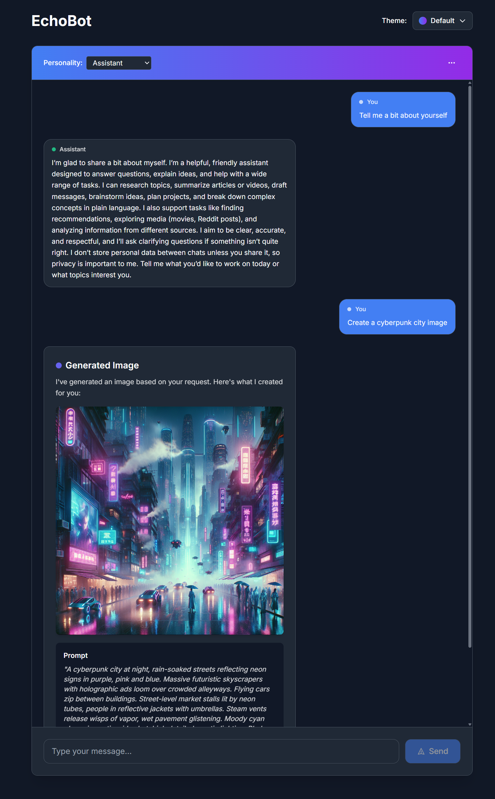

# AI Chatbot Agent

A modern AI-powered chatbot built with Next.js and OpenAI's GPT models. The agent can perform various tasks through specialized tools and provides rich, interactive responses.

<div align="center">
  
</div>

## 🚀 Features

### Core Capabilities
- **Interactive Chat Interface**: Clean, responsive web UI with React and Tailwind CSS
- **Multi-Tool Agent**: Integrates specialized tools for different tasks
- **Personality System**: 6 distinct AI personalities
- **Structured Output**: Rich, formatted responses with custom components
- **Approval System**: User approval for sensitive operations like image generation
- **Memory Management**: Persistent conversation history with Upstash Redis (production) or LowDB (development)
- **RAG Integration**: Vector search for movie recommendations
- **Theme Support**: Multiple visual themes with dynamic switching

### Available Tools

1. **🎬 Movie Search**
   - Search movie database with filters (genre, director, year)
   - Powered by vector embeddings and RAG
   - Returns structured movie recommendations with ratings and descriptions

2. **🎨 Image Generation**
   - Generate images using DALL-E 3
   - Requires user approval before generation
   - Displays images with download links

3. **📺 YouTube Transcriber**
   - Analyze YouTube videos by transcribing and searching their content
   - Answer questions about video content
   - Summarize videos or find specific information
   - Uses embeddings for semantic search across transcripts

4. **🌐 Website Scraper**
   - Extract and analyze content from articles and web pages
   - Answer questions about article content
   - Summarize articles or find specific information
   - Uses Mozilla Readability for clean text extraction

5. **😄 Dad Jokes**
   - Fetch random dad jokes from icanhazdadjoke.com
   - Simple entertainment feature

6. **🔗 Reddit Posts**
   - Browse trending posts from Reddit
   - Shows title, subreddit, author, and upvotes

### Personality System

The chatbot features 6 distinct personalities that affect how responses are delivered:

1. **Assistant** (Default) - Professional, clear, and helpful
2. **Pirate** 🏴‍☠️ - Whimsical pirate with nautical metaphors and swagger
3. **Murderbot** 🤖 - Sardonic, reluctant robotic security unit (inspired by Martha Wells' novels)
4. **The Good Boy** 🐕 - Enthusiastic, loyal Golden Retriever personality
5. **The Overlord** 👑 - Hyper-rational AI superintelligence with plans for world domination
6. **Valley Girl** 💕 - Bubbly, upbeat, and totally supportive with Valley Girl speak

## 🛠️ Tech Stack

### Frontend
- **Next.js 15.5.4** - React framework
- **React 19.1.0** - UI library
- **TypeScript** - Type safety
- **Tailwind CSS** - Styling

### Backend & AI
- **OpenAI GPT-5-nano** - Language model
- **DALL-E 3** - Image generation
- **Upstash Redis** - Session management and memory (production)
- **Upstash Vector** - Vector database for movie search
- **LowDB** - JSON database for memory (development)
- **youtubei.js** - YouTube transcript extraction
- **Mozilla Readability** - Article content extraction
- **JSDOM** - HTML parsing for web scraping

### Development Tools
- **Autoevals** - Testing framework
- **Zod** - Schema validation
- **Chalk & Ora** - Terminal styling and spinners

## 📋 Prerequisites

- **Node.js 20+** or **Bun**
- **OpenAI API Key** - Get from [OpenAI Platform](https://platform.openai.com/settings/organization/api-keys)
- **Upstash Redis** - For production session management (optional, uses LowDB in development)
- **Upstash Vector Database** - For movie search (optional)

## 🚀 Quick Start

### 1. Install Dependencies

```bash
npm install
# or
bun install
```

### 2. Environment Setup

Create a `.env` file:

```env
OPENAI_API_KEY=your_openai_api_key_here
```

### 3. Set Up Production Memory (Optional)

For production deployments, configure Upstash Redis for session management:

```env
UPSTASH_REDIS_REST_URL=your_upstash_redis_url
UPSTASH_REDIS_REST_TOKEN=your_upstash_redis_token
```

*Note: In development, the app uses LowDB (db.json) for local storage.*

### 4. Set Up Movie Database (Optional)

```env
UPSTASH_VECTOR_REST_URL=your_upstash_vector_url
UPSTASH_VECTOR_REST_TOKEN=your_upstash_vector_token
```

```bash
npm run ingest
```

### 5. Run the App

```bash
npm run dev
```

Visit `http://localhost:3000`

## 🎯 Usage

### Web Interface

1. Open `http://localhost:3000`
2. **Choose a Personality**: Select your preferred AI personality (Assistant, Pirate, Murderbot, The Good Boy, The Overlord, or Valley Girl)
3. **Choose a Theme**: Use the theme dropdown to select your preferred visual style
4. Start chatting with the AI
5. Try these examples:
   - "Find me some action movies from the 90s"
   - "Generate an image of a futuristic city"
   - "https://www.youtube.com/watch?v=... what are the main points in this video?"
   - "Summarize this article: https://example.com/article"
   - "Tell me a dad joke"
   - "What's trending on Reddit?"

### Command Line

```bash
npm run agent "Find me a good sci-fi movie"
```

### Developer Mode

Toggle dev mode in the UI to see tool usage and debug info.

## 🧪 Testing

Run evaluations to test agent performance:

```bash
# Run all tests
npm run eval

# Run specific tests
npm run eval movieSearch
npm run eval generateImage
npm run eval youtubeTranscriber
npm run eval websiteScraper
npm run eval dadJoke
npm run eval reddit
```
